1090CSET.FNT 
  

ACORN.FNT 
  

AGASOFT.FNT 
  

ANGLIK.FNT 
  

ANTIC3.FNT 
  

ANTIK2.FNT 
  

ANTIK.FNT 
  

APPOFNT.FNT 
  

ARCHAIC.FNT 
  

AR.FNT 
  

AROGUE.FNT 
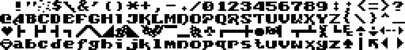  

ASPGOTH.FNT 
  

ATARI.FNT 
  

ATOMINO.FNT 
  

AVANT.FNT 
  

AWP.FNT 
  

BACKTALK.FNT 
  

BALLFNT.FNT 
  

BALOON.FNT 
  

BARYMAG.FNT 
  

BATFNT.FNT 
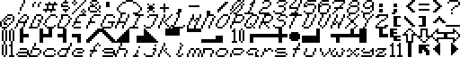  

BIG2.FNT 
  

BIG.FNT 
  

BIGOLD.FNT 
  

BITWY.FNT 
  

BLMON.FNT 
  

BLOCK2.FNT 
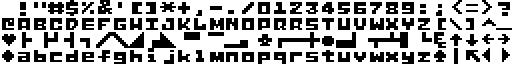  

BLOCK.FNT 
  

BRIDGE.FNT 
  

BROADWAY.FNT 
  

BZZZ1.FNT 
  

BZZZ2.FNT 
  

BZZZ3.FNT 
  

CARUN1.FNT 
  

CARUN2.FNT 
  

CASUALGT.FNT 
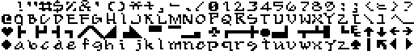  

CHOPER1.FNT 
  

CHOPER2.FNT 
  

CHOPER3.FNT 
  

CHOPER4.FNT 
  

CHOPER5.FNT 
  

CHRIS.FNT 
  

CHSET.FNT 
  

CMC.FNT 
  

COMP1.FNT 
  

COMPUTER.FNT 
  

COMPUT.FNT 
  

CONSOLE.FNT 
  

CONSOLE_ORG.FNT 
  

COPY80K.FNT 
  

COPY98K.FNT 
  

COSDEM1.FNT 
  

COSDEM2.FNT 
  

COSDEM3.FNT 
  

CRASWAL.FNT 
  

CURSIVE.FNT 
  

DM.FNT 
  

DOCUMENT.FNT 
  

DOCUM.FNT 
  

DOL.FNT 
  

DRACONUS.FNT 
  

ECKIG.FNT 
  

ELEKTRIK.FNT 
  

ELEKTRO.FNT 
  

EQUALIZ.FNT 
  

FANCY.FNT 
  

FAT.FNT 
  

FIRSTFNT.FNT 
  

FIVEDEM.FNT 
  

FLOYD1.FNT 
  

FLOYD2.FNT 
  

FLYER.FNT 
  

FNT1.FNT 
  

FNT2.FNT 
  

FNT3.FNT 
  

FNT4.FNT 
  

FONT10.FNT 
  

FONT11.FNT 
  

FONT12.FNT 
  

FONT1.FNT 
  

FONT1_.FNT 
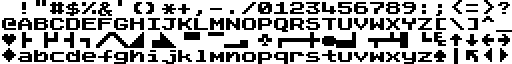  

FONT2.FNT 
  

FONT2_.FNT 
  

FONT3.FNT 
  

FONT3_.FNT 
  

FONT4.FNT 
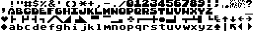  

FONT5.FNT 
  

FONT6.FNT 
  

FONT7.FNT 
  

FONT8.FNT 
  

FONT9.FNT 
  

FONT.FNT 
  

FONT_.FNT 
  

FONT__.FNT 
  

FONTY2.FNT 
  

FXCK1.FNT 
  

FXCK2.FNT 
  

GEOGRAF.FNT 
  

GHOST.FNT 
  

GIGA.FNT 
  

GORA.FNT 
  

GOTHIC.FNT 
  

GOTYK3.FNT 
  

GREEK.FNT 
  

GREETFNT.FNT 
  

GRUBE.FNT 
  

HEAVY.FNT 
  

HIGH.FNT 
  

HOHL.FNT 
  

HORROR2.FNT 
  

HTTFONT.FNT 
  

HUGO1.FNT 
  

HUGO2.FNT 
  

HUGO.FNT 
  

IKONY.FNT 
  

INT.FNT 
  

INVERS.FNT 
  

ISO.FNT 
  

ITALICI.FNT 
  

IVO1.FNT 
  

JERRY.FNT 
  

KAMPANIA.FNT 
  

KASDEMO.FNT 
  

KOLEDA.FNT 
  

KOPFCHR.FNT 
  

KOSCI2.FNT 
  

KOSCI.FNT 
  

KRYSZTAL.FNT 
  

KULOMINO.FNT 
  

LASER1.FNT 
  

LASER2.FNT 
  

LASER3.FNT 
  

LASER4.FNT 
  

LITERKI.FNT 
  

LLAMA.FNT 
  

LOTEK.FNT 
  

MAGAZIN.FNT 
  

MARCO.FNT 
  

MARIO1.FNT 
  

MARIO2.FNT 
  

MASTMIN.FNT 
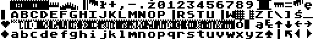  

METAL.FNT 
  

MHALLFNT.FNT 
  

MICRODEM.FNT 
  

MODERNE.FNT 
  

MODERN.FNT 
  

MOJ.FNT 
  

MOREFNT.FNT 
  

MYDEMO.FNT 
  

NC1.FNT 
  

NC2.FNT 
  

NC3.FNT 
  

NC4.FNT 
  

NC5.FNT 
  

NC6.FNT 
  

NC7.FNT 
  

NEWINT.FNT 
  

OBCY2.FNT 
  

OBCY.FNT 
  

OLDE.FNT 
  

OLDSTYLE.FNT 
  

OROGRAF.FNT 
  

OUTLINE2.FNT 
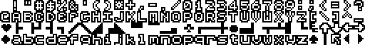  

OUTLINE.FNT 
  

P6.FNT 
  

P6FNT.FNT 
  

PANTH.FNT 
  

PARAFNT.FNT 
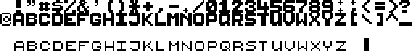  

PARALAX.FNT 
  

PE2.FNT 
  

PEARL.FNT 
  

PE.FNT 
  

PIGULA.FNT 
  

POLFONT.FNT 
  

PREPPIE.FNT 
  

PROP.FNT 
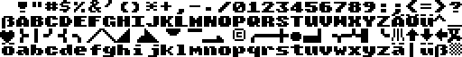  

QUATRO.FNT 
  

REBOUND.FNT 
  

REVERSE.FNT 
  

RICFONT.FNT 
  

RK.FNT 
  

ROBBO1.FNT 
  

ROBBO2.FNT 
  

ROBBO3.FNT 
  

ROBOT.FNT 
  

ROGUE.FNT 
  

ROMAN2.FNT 
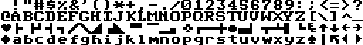  

ROMAN.FNT 
  

ROTFNT.FNT 
  

RSPEED.FNT 
  

RZBIK.FNT 
  

S_A_OPIS.FNT 
  

S_A_SET.FNT 
  

SBW1.FNT 
  

SBW2.FNT 
  

SBW3.FNT 
  

SBW4.FNT 
  

SBW5.FNT 
  

SBW6.FNT 
  

SCEN1.FNT 
  

SCEN2.FNT 
  

SCHREIB.FNT 
  

SCRIBBLE.FNT 
  

SCRIPT2.FNT 
  

SCRIPT.FNT 
  

SEXQUIX2.FNT 
  

SEXQUIX.FNT 
  

SINCLAIR.FNT 
  

SNOKIE.FNT 
  

SOLODB.FNT 
  

SOLODT.FNT 
  

SPDSCRP.FNT 
  

SPYMAS.FNT 
  

STOP2.FNT 
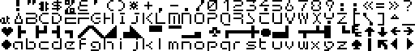  

STOP.FNT 
  

STRACK.FNT 
  

STRICH.FNT 
  

STRIPFNT.FNT 
  

STYLISH.FNT 
  

SUPERFAT.FNT 
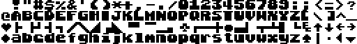  

SZPER1.FNT 
  

SZPER2.FNT 
  

TA1.FNT 
  

TA2.FNT 
  

TBXL.FNT 
  

THEJET1.FNT 
  

THEJET2.FNT 
  

TITEL.FNT 
  

TOMAHAWK.FNT 
  

TOMS260.FNT 
  

TRIX.FNT 
  

TUI.FNT 
  

UCZEN1.FNT 
  

UCZEN2.FNT 
  

UCZEN3.FNT 
  

UCZEN4.FNT 
  

WEIRDO.FNT 
  

WERDSK.FNT 
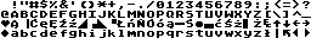  

WIDE.FNT 
  

WORK1.FNT 
  

WORK2.FNT 
  

XFONT.FNT 
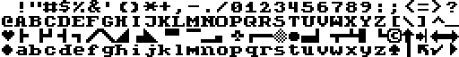  

ZNAKI.FNT 
  

