1090CSET.FNT  
  

AC2.FNT  
  

ACADEMY.FNT  
  

AC.FNT  
  

ACORN.FNT  
  

ADAMS.FNT  
  

ADM.FNT  
  

ADVEN.FNT  
  

ADVENTUR.FNT  
  

AGASOFT.FNT  
  

ALLPRPS.FNT  
  

ANALOG.FNT  
  

ANGLIK.FNT  
  

ANIMATE.FNT  
  

ANTED.FNT  
  

ANTIC2.FNT  
  

ANTIC3.FNT  
  

ANTIC_4.FNT  
  

ANTIK2.FNT  
  

ANTIK2PL.FNT  
  

ANTIK.FNT  
  

APPLKILL.FNT  
  

APPOFNT.FNT  
  

ARABIC.FNT  
  

ARCHAIC1.FNT  
  

ARCHAIC3.FNT  
  

ARCHAIC.FNT  
  

AREX.FNT  
  

AR.FNT  
  

ARROWS.FNT  
  

ARTDECO.FNT  
  

ASCPRIN.FNT  
  

ASPGOTH.FNT  
  

ASTRO.FNT  
  

ATARI.FNT  
  

ATARI_FONT.FNT  
  

ATARIPL.FNT  
  

ATOMINO.FNT  
  

AVANT.FNT  
  

AWP.FNT  
  

BACKTALK-2.FNT  
  

BACKTALK.FNT  
  

BALLFNT.FNT  
  

BALON.FNT  
  

BALOON.FNT  
  

BARYMAG.FNT  
  

BATTLE.FNT  
  

BBC_SET.FNT  
  

BIG2.FNT  
  

BIG.FNT  
  

BIGOLD.FNT  
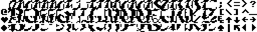  

BIGONES.FNT  
  

BIGPL.FNT  
  

BITWY.FNT  
  

BJACK1.FNT  
  

BJ_PANEL.FNT  
  

BLMON.FNT  
  

BLOCK2ND.FNT  
  

BLOCK3.FNT  
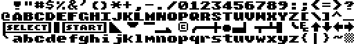  

BLOCK3RD.FNT  
  

BLOCK.FNT  
  

BLUE.FNT  
  

BOARD.FNT  
  

BOLDDE.FNT  
  

BOLD.FNT  
  

BORDERS.FNT  
  

BRAILLE.FNT  
  

BREIT.FNT  
  

BRIDGE.FNT  
  

BROADWAY-2.FNT  
  

BROADWAY.FNT  
  

BZZZ1.FNT  
  

BZZZ2.FNT  
  

BZZZ3.FNT  
  

C64.FNT  
  

CA1.FNT  
  

CA2.FNT  
  

CAPS.FNT  
  

CARDS.FNT  
  

CARUN1.FNT  
  

CARUN2.FNT  
  

CASUAL.FNT  
  

CHAR4.FNT  
  

CHAR5.FNT  
  

CHAR.FNT  
  

CHARLIE.FNT  
  

CHARSET.FNT  
  

CHOMP.FNT  
  

CHOPER1.FNT  
  

CHOPER2.FNT  
  

CHOPER3.FNT  
  

CHOPER4.FNT  
  

CHRIS.FNT  
  

CHSET2.FNT  
  

CHSET.FNT  
  

CIRCUIT.FNT  
  

CITOPLAZMA8X8.FNT  
  

CLASSIC.FNT  
  

CMC.FNT  
  

COLUMN.FNT  
  

COMP1.FNT  
  

COMP2.FNT  
  

COMPUT4.FNT  
  

COMPUTER.FNT  
  

COMPUT.FNT  
  

COMPUTR1.FNT  
  

COMPUTR2.FNT  
  

COMPUTR3.FNT  
  

COMPUTR4.FNT  
  

CONSOLE.FNT  
  

CONSOLE_ORG.FNT  
  

CONVOY.FNT  
  

COPY80K.FNT  
  

COPY98K.FNT  
  

COSDEM1.FNT  
  

COSDEM2.FNT  
  

COSDEM3.FNT  
  

COUNTRY.FNT  
  

CRASWAL.FNT  
  

CRAZY.FNT  
  

CROSTOMB.FNT  
  

CURL.FNT  
  

CURSCS.FNT  
  

CURSIVE2.FNT  
  

CURSIVE3.FNT  
  

CURSIVE4.FNT  
  

CURSIVE.FNT  
  

DATA.FNT  
  

DATRI.FNT  
  

DBL.FNT  
  

DBLROMAN.FNT  
  

DBLTHIN.FNT  
  

DESCEND.FNT  
  

DEVE.FNT  
  

DICK.FNT  
  

DIGI.FNT  
  

DIGITAL.FNT  
  

DINO.FNT  
  

DM.FNT  
  

DOCUMENT.FNT  
  

DOCUM.FNT  
  

DOL.FNT  
  

DRACONUS.FNT  
  

DRAGONSI.FNT  
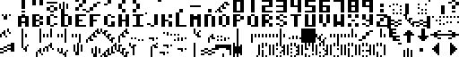  

DYNAK_2000_23FF_FONT.FNT  
  

DYNAK_2800_2BFF.FNT  
  

ECKIG2PL.FNT  
  

ECKIG.FNT  
  

EED22C.FNT  
  

EGG2.FNT  
  

EGG.FNT  
  

EIGHTY.FNT  
  

EL1.FNT  
  

EL1W.FNT  
  

ELEKTRIK.FNT  
  

ELEKTRO.FNT  
  

ELEKTRPL.FNT  
  

EMBLEM.FNT  
  

EMBOSSED.FNT  
  

ENCOUNT.FNT  
  

EPROM.FNT  
  

EPSTAN.FNT  
  

EQUALIZ.FNT  
  

EUROPA.FNT  
  

EUROPEAN.FNT  
  

F80.FNT  
  

F8X6.FNT  
  

FANCY1.FNT  
  

FANCY3.FNT  
  

FANCY4.FNT  
  

FANCY5.FNT  
  

FAT2.FNT  
  

FAT64.FNT  
  

FAT.FNT  
  

FATPL.FNT  
  

FENCEPS.FNT  
  

FIRSTFNT.FNT  
  

FIVEDEM.FNT  
  

FLATFOOT.FNT  
  

FLOYD1.FNT  
  

FLOYD2.FNT  
  

FLYER.FNT  
  

FNT1.FNT  
  

FNT2.FNT  
  

FNT3.FNT  
  

FNT4.FNT  
  

FNTDITH.FNT  
  

FONT10.FNT  
  

FONT11.FNT  
  

FONT12.FNT  
  

FONT1B.FNT  
  

FONT1.FNT  
  

FONT21.FNT  
  

FONT2.FNT  
  

FONT2_.FNT  
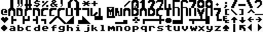  

FONT30.FNT  
  

FONT3.FNT  
  

FONT3_.FNT  
  

FONT5.FNT  
  

FONT6.FNT  
  

FONT7.FNT  
  

FONT8.FNT  
  

FONT9.FNT  
  

FONT.FNT  
  

FONT_.FNT  
  

FONTS1.FNT  
  

FONTS2.FNT  
  

FONTS.FNT  
  

FONTY2.FNT  
  

FUTURE.FNT  
  

FXCK1.FNT  
  

FXCK2.FNT  
  

GAMEOVER.FNT  
  

GEM.FNT  
  

GEOGRAF.FNT  
  

GHOST.FNT  
  

GIGA.FNT  
  

GLADIATR.FNT  
  

GOLDHUNT.FNT  
  

GORA.FNT  
  

GOTHIC2.FNT  
  

GOTHIC3.FNT  
  

GOTHIC4.FNT  
  

GOTHIC.FNT  
  

GOTYK3.FNT  
  

GREEK1.FNT  
  

GREEKAT1.FNT  
  

GREEKAT.FNT  
  

GREEK.FNT  
  

GRUBE.FNT  
  

H3X0R_DELUXE2.FNT  
  

H3X0R_DELUXE3.FNT  
  

H3X0R_EXPLODE.FNT  
  

HBRWSYS.FNT  
  

HEAVY.FNT  
  

HEBREW.FNT  
  

HEBRU.FNT  
  

HEHE.FNT  
  

HELPTOON.FNT  
  

HERO.FNT  
  

HIERO.FNT  
  

HIGH.FNT  
  

HOBO.FNT  
  

HOCH.FNT  
  

HOHL.FNT  
  

HOMEPAK.FNT  
  

HOPPE2.FNT  
  

HOPPE.FNT  
  

HORROR2.FNT  
  

HORSE.FNT  
  

HORSES.FNT  
  

HOVER.FNT  
  

HSOFT.FNT  
  

HTTFONT.FNT  
  

HUBBA.FNT  
  

HUGO1.FNT  
  

HUGO2.FNT  
  

HUGO.FNT  
  

IKONY.FNT  
  

IMP1029.FNT  
  

INITPRG.FNT  
  

INTER.FNT  
  

INT.FNT  
  

INVADOR1.FNT  
  

INVADOR2.FNT  
  

INVERS.FNT  
  

ISO.FNT  
  

ITALIC2.FNT  
  

ITALIC3.FNT  
  

ITALICI.FNT  
  

ITALICPL.FNT  
  

ITALICS.FNT  
  

IVO1.FNT  
  

JAGGED.FNT  
  

JAPAN.FNT  
  

JERRY.FNT  
  

JESENGLS.FNT  
  

JESUSAVS.FNT  
  

JESUSLVS.FNT  
  

JIGSAW.FNT  
  

JWGIANT.FNT  
  

KAISER.FNT  
  

KAMPANIA.FNT  
  

KASDEMO.FNT  
  

KAZ1.FNT  
  

KAZ2.FNT  
  

KAZ3.FNT  
  

KAZ4.FNT  
  

KAZ5.FNT  
  

KAZ6.FNT  
  

KNIFFEL.FNT  
  

KOLEDA.FNT  
  

KOPFCHR.FNT  
  

KOSCI2.FNT  
  

KOSCI.FNT  
  

KRIEG.FNT  
  

KRYSZTAL.FNT  
  

KSIAZE.FNT  
  

KULOMINO.FNT  
  

LARGE1.FNT  
  

LARGE.FNT  
  

LASER1.FNT  
  

LASER2.FNT  
  

LASER3.FNT  
  

LASER4.FNT  
  

LATEIN.FNT  
  

LEVEL15_BST.FNT  
  

LEVEL1_BST.FNT  
  

LEVEL20_BST.FNT  
  

LEVEL25_BST.FNT  
  

LEVEL3_BST_N.FNT  
  

LIGHT.FNT  
  

LITERKI.FNT  
  

LLAMA.FNT  
  

LOGIC.FNT  
  

LOTEK.FNT  
  

LSHADOW.FNT  
  

MAGAZIN.FNT  
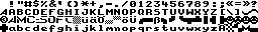  

MANAGER.FNT  
  

MARCO.FNT  
  

MARIO1.FNT  
  

MARIO2.FNT  
  

MASTMIND.FNT  
  

MATH.FNT  
  

MAX.FNT  
  

METAL.FNT  
  

MHALLFNT.FNT  
  

MICRODEM.FNT  
  

MISC.FNT  
  

MODERNE.FNT  
  

MODERN.FNT  
  

MODROMAN.FNT  
  

MOJ.FNT  
  

MONOPOLY.FNT  
  

MOONLORD.FNT  
  

MOOSE.FNT  
  

MOREFNT.FNT  
  

MOSIE.FNT  
  

MURDER.FNT  
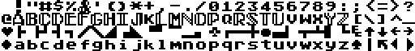  

MYDEMO.FNT  
  

NATO.FNT  
  

NC1.FNT  
  

NC2.FNT  
  

NC3.FNT  
  

NC4.FNT  
  

NC5.FNT  
  

NC6.FNT  
  

NC7.FNT  
  

NEWINT.FNT  
  

NEWSLETR.FNT  
  

NEWXLP.FNT  
  

NICE.FNT  
  

NICEONE.FNT  
  

NICETINY.FNT  
  

NORMAL.FNT  
  

NORTH.FNT  
  

NVDI8.FNT  
  

OBCY2.FNT  
  

OBCY.FNT  
  

OBLIQUE.FNT  
  

OLDE.FNT  
  

OLDENGL2.FNT  
  

OLDENGL.FNT  
  

OLDSTYLE.FNT  
  

ORTOGRAF.FNT  
  

OUTLINE1.FNT  
  

OUTLINE.FNT  
  

OZHT.FNT  
  

P6FNT.FNT  
  

PACMAD2.FNT  
  

PACMAD32.FNT  
  

PACMAD7.FNT  
  

PACMAD8SOLID.FNT  
  

PANTHER1.FNT  
  

PANTHER2.FNT  
  

PANTH.FNT  
  

PARALAX.FNT  
  

PASCDCRV.FNT  
  

PASCEND.FNT  
  

PCAE.FNT  
  

PCURVE.FNT  
  

PE2.FNT  
  

PEARL.FNT  
  

PEDROKKO.FNT  
  

PE.FNT  
  

PENMAN.FNT  
  

PERFECT.FNT  
  

PHARD.FNT  
  

PIC.FNT  
  

PIGULA.FNT  
  

PIPELINE.FNT  
  

POINT.FNT  
  

POLFONT.FNT  
  

POPUPS.FNT  
  

PREGULAR.FNT  
  

PREPPIE2.FNT  
  

PREPPIE.FNT  
  

PROPORT.FNT  
  

PSQUARE.FNT  
  

PTHINCRV.FNT  
  

PTHIN.FNT  
  

PTHINST.FNT  
  

PUCMUC.FNT  
  

PUSH.FNT  
  

PWIDECRV.FNT  
  

PWIDE.FNT  
  

PWIDEST.FNT  
  

QUATRO.FNT  
  

RALLY.FNT  
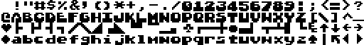  

READTBIB.FNT  
  

REBOUND.FNT  
  

RED.FNT  
  

REVERSE.FNT  
  

RICFONT.FNT  
  

RICOCHET.FNT  
  

RK.FNT  
  

ROBBO1.FNT  
  

ROBBO2.FNT  
  

ROBBO2P.FNT  
  

ROBBO3.FNT  
  

ROBBOP.FNT  
  

ROBBOPL.FNT  
  

ROBIN.FNT  
  

ROBOT.FNT  
  

ROGUE.FNT  
  

ROMAN.FNT  
  

ROTFNT.FNT  
  

RSHADOW.FNT  
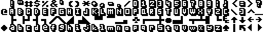  

RSPEED.FNT  
  

RUS.FNT  
  

RUS_.FNT  
  

RUSSIAN.FNT  
  

RUSSISCH.FNT  
  

RZBIK.FNT  
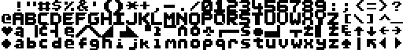  

SANSERIF.FNT  
  

S_A_OPIS.FNT  
  

S_A_SET.FNT  
  

SATANS.FNT  
  

SBW1.FNT  
  

SBW2.FNT  
  

SBW3.FNT  
  

SBW4.FNT  
  

SBW5.FNT  
  

SBW6.FNT  
  

SCEN1.FNT  
  

SCEN2.FNT  
  

SCHALTG.FNT  
  

SCHREIB2.FNT  
  

SCHREIB.FNT  
  

SCRIBBLE.FNT  
  

SCRID.FNT  
  

SCRIPT2.FNT  
  

SCRIPT3.FNT  
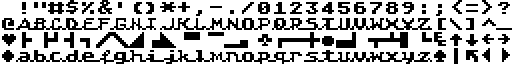  

SCRIPT4.FNT  
  

SCRIPT.FNT  
  

SE.FNT  
  

SET2.FNT  
  

SET4.FNT  
  

SET6.FNT  
  

SEXQUIX2.FNT  
  

SEXQUIX.FNT  
  

SGLROMAN.FNT  
  

SGLSANS.FNT  
  

SHADOW.FNT  
  

SHIT.FNT  
  

SIDEATAR.FNT  
  

SIDEWAYS.FNT  
  

SIMPLEX.FNT  
  

SINCLAIR.FNT  
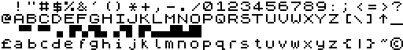  

SKEET.FNT  
  

SKYSCRAPER_TEXT.FNT  
  

SNOKIE.FNT  
  

SNOWBALL.FNT  
  

SOLODB.FNT  
  

SOLODT.FNT  
  

SOLO.FNT  
  

SOUTH.FNT  
  

SPDSCRP.FNT  
  

SPECIAL.FNT  
  

SPYMAS.FNT  
  

SQUAD.FNT  
  

SQUARE2.FNT  
  

SR30FONT.FNT  
  

STAR.FNT  
  

STARS.FNT  
  

STARYDOM4.FNT  
  

STENCIL.FNT  
  

STOP.FNT  
  

STRACK.FNT  
  

STRICH.FNT  
  

STRIPFNT.FNT  
  

STRWRROR.FNT  
  

STYLISH2.FNT  
  

STYLISH.FNT  
  

SWORD.FNT  
  

SYSTEM.FNT  
  

SZPER1.FNT  
  

SZPER2.FNT  
  

TA1.FNT  
  

TA2.FNT  
  

TACCHR.FNT  
  

TAKE.FNT  
  

TANNER.FNT  
  

TBXL.FNT  
  

TEST.FNT  
  

TEXT.FNT  
  

TEXTPRO.FNT  
  

TEXTTO.FNT  
  

THEJET1.FNT  
  

THEJET2.FNT  
  

THICK.FNT  
  

THIN2.FNT  
  

THIN64.FNT  
  

THINCS.FNT  
  

THIN.FNT  
  

TIEF.FNT  
  

TIMS.FNT  
  

TITEL.FNT  
  

TITLE_SCORE.FNT  
  

TMC.FNT  
  

TMCPROG.FNT  
  

TOMAHAWK.FNT  
  

TOMS260.FNT  
  

TPBIG.FNT  
  

TPC2.FNT  
  

TPC.FNT  
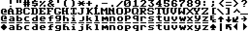  

TPFNC.FNT  
  

TRAINS.FNT  
  

TREE.FNT  
  

TRIX.FNT  
  

TRVQUEST.FNT  
  

TUI.FNT  
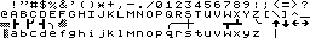  

UBEK.FNT  
  

UCZEN1.FNT  
  

UCZEN2.FNT  
  

UCZEN3.FNT  
  

UCZEN4.FNT  
  

UNDERLIN.FNT  
  

UNDRLINE.FNT  
  

WALL.FNT  
  

WARHAWK1.FNT  
  

WARHAWK2.FNT  
  

WEIRDO.FNT  
  

WHIRLWND.FNT  
  

WIDE.FNT  
  

WIZARD.FNT  
  

WORK1.FNT  
  

WORK2.FNT  
  

WORLDS.FNT  
  

WRITTEN.FNT  
  

XFTOOL.FNT  
  

XIRI1.FNT  
  

XIRI_ANIM.FNT  
  

YAHTZEE.FNT  
  

ZEBRA.FNT  
  

ZEICHEN.FNT  
  

ZILCH.FNT  
  

ZNAC64.FNT  
  

ZNAKI.FNT  
  

ZX81_SET.FNT  
  

