ACEFont  
  

Arc7by8  
  

ArcItalic  
  

ArcNormal  
  

ArcThin  
  

ArcVDX  
  

Bank  
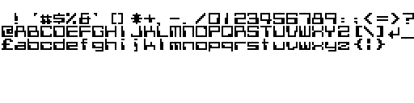  

Betty  
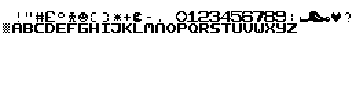  

Bit7Inv  
  

Bit7Thin  
  

Bold1  
  

Bold2  
  

Bold  
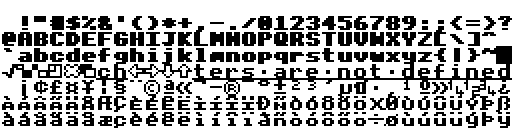  

Broadway  
  

CelFont  
  

chocolate0  
  

CyrillicHi  
  

Cyrillic  
  

Data  
  

Default  
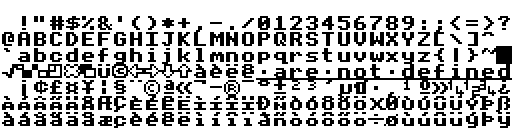  

DK-Tegn  
  

DK-TegnTH  
  

Dungeon  
  

Euro  
  

Fade  
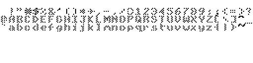  

Fancy  
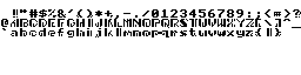  

Fat  
  

FBFont  
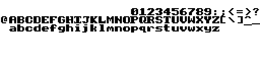  

FeltPen  
  

FinePrint  
  

Flat  
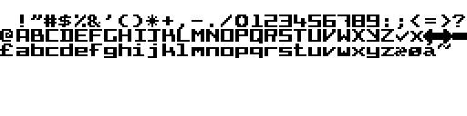  

Fontz  
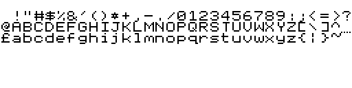  

Futura  
  

Future2  
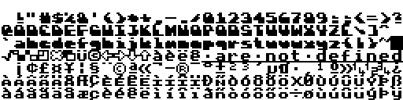  

Future3  
  

Future  
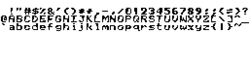  

Goodies  
  

Grave  
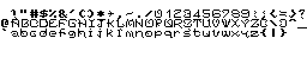  

GreekLow  
  

Greek  
  

Heavy  
  

Hebrew  
  

Hiragana  
  

HiTechB  
  

HiTech  
  

HiTechT  
  

Hose  
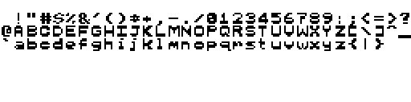  

HugoChars  
  

IBMFont  
  

IBMSet  
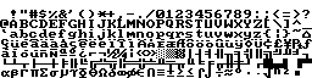  

Inverse2  
  

Inverse  
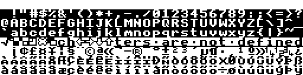  

Italic1  
  

Italic2  
  

Italic3  
  

Italic4  
  

Italic5  
  

Italic6  
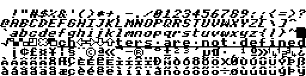  

Italic  
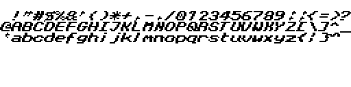  

ItalThin  
  

JapanNums  
  

Katakana  
  

Large  
  

Latin1  
  

Latin2  
  

Latin3  
  

Latin4  
  

Latin9  
  

LCD  
  

LEDs  
  

Lowercase  
  

MathSet  
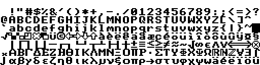  

MgaBold  
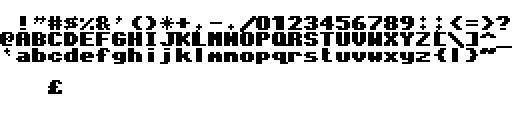  

MiniCap  
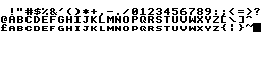  

Modern  
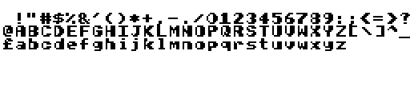  

NeoGoth  
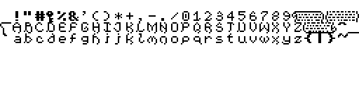  

NewFont  
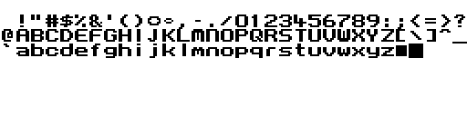  

Outline2  
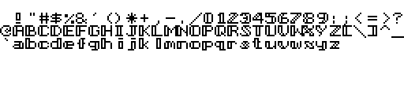  

Outline  
  

PCchars  
  

README.md  
  

RndCaps  
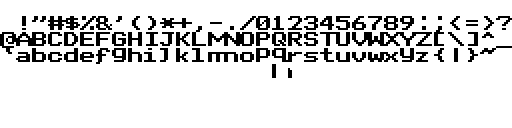  

Rounded  
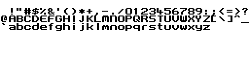  

Round  
  

Script2  
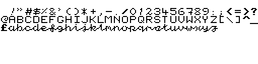  

ScriptObl  
  

Script  
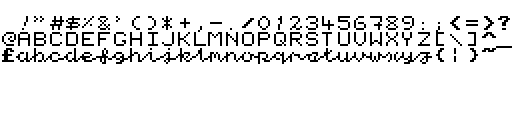  

Serif  
  

Shadow2  
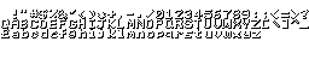  

Shadow  
  

Simple  
  

Square  
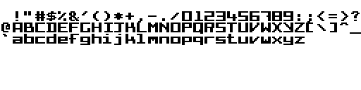  

Squiggly  
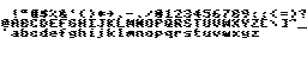  

Tall  
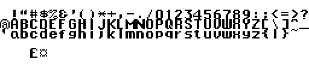  

Theatre  
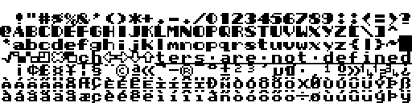  

Theatrical  
  

Thin1  
  

Thin2  
  

Thin3  
  

TMSRItalic  
  

TMSRLight  
  

TMSR  
  

TrekFont  
  

Trendy  
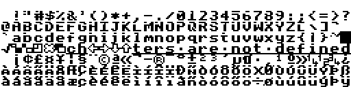  

Triang  
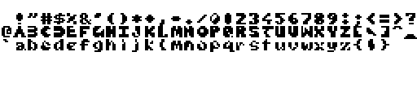  

TtxtJoin  
  

TtxtSepr  
  

TypFace  
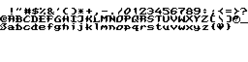  

ULine  
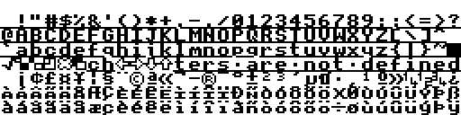  

Weird  
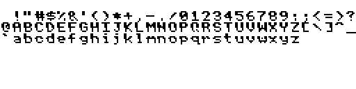  

Wiggle  
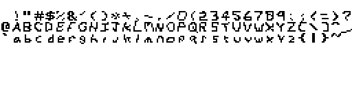  

Wimp0  
  

Wimp1  
  

WordFnt  
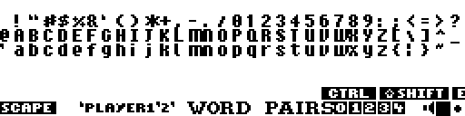  

