Arc7by8  
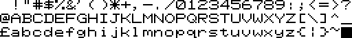  
  
ArcItalic  
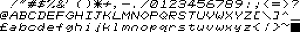  
  
ArcNormal  
  
  
ArcThin  
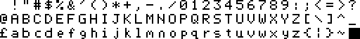  
  
ArcVDX  
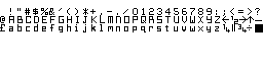  
  
Bit7Inv  
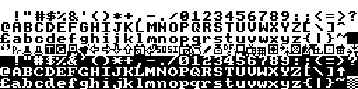  
  
Bit7Thin  
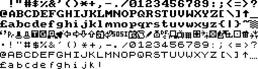  
  
Bold1  
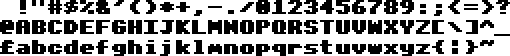  
  
Bold2  
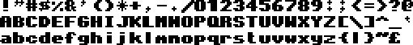  
  
Broadway  
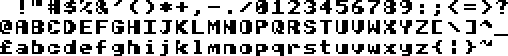  
  
CelFont  
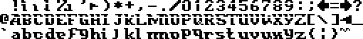  
  
chocolate0  
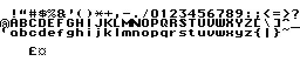  
  
chocolate1  
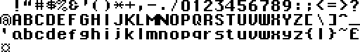  
  
Cyrillic  
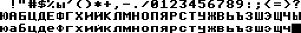  
  
CyrillicHi  
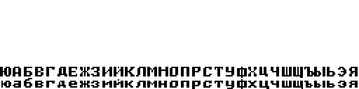  
  
Data  
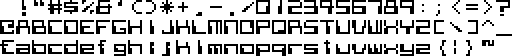  
  
DK-Tegn  
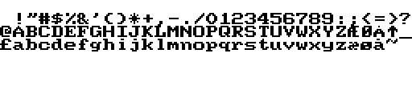  
  
DK-TegnTH  
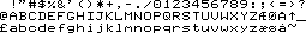  
  
Dungeon  
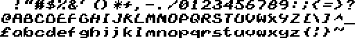  
  
Euro  
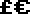  
  
Fat  
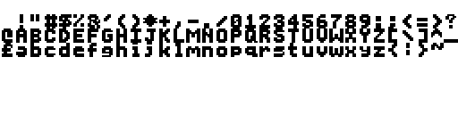  
  
FeltPen  
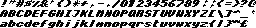  
  
FinePrint  
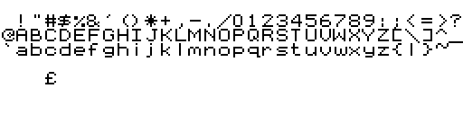  
  
Futura  
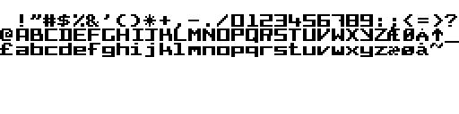  
  
Goodies  
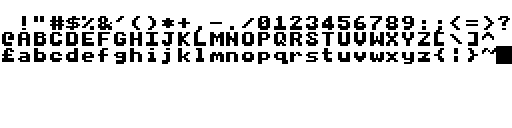  
  
Greek  
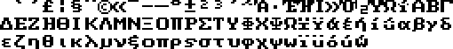  
  
GreekLow  
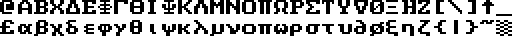  
  
Hebrew  
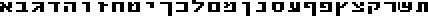  
  
Hiragana  
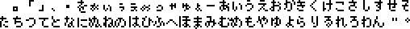  
  
HiTech  
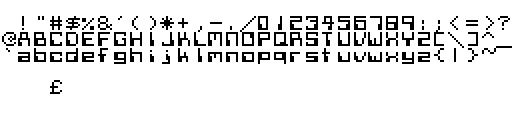  
  
HiTechB  
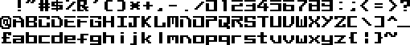  
  
HiTechT  
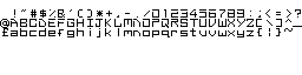  
  
HugoChars  
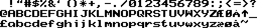  
  
IBMFont  
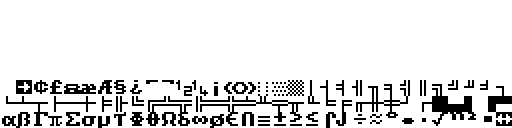  
  
images  
  
  
Italic1  
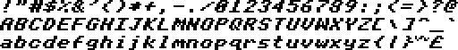  
  
Italic2  
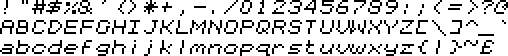  
  
Italic3  
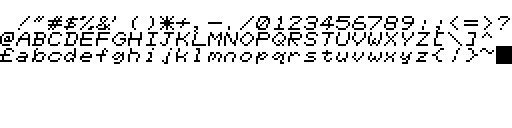  
  
Italic4  
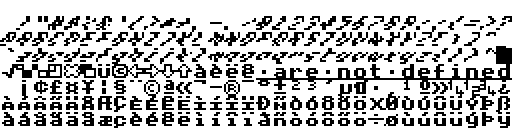  
  
Italic5  
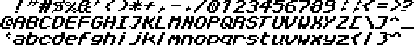  
  
ItalThin  
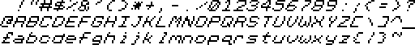  
  
JapanNums  
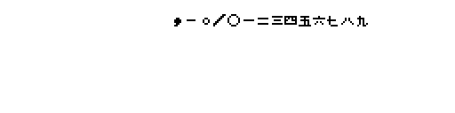  
  
Katakana  
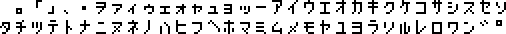  
  
Large  
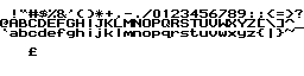  
  
Latin1  
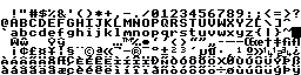  
  
Latin2  
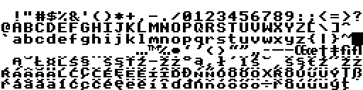  
  
Latin3  
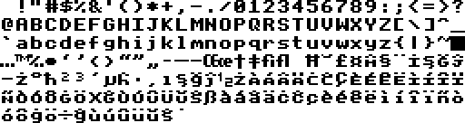  
  
Latin4  
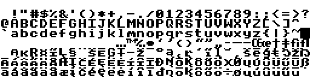  
  
Latin9  
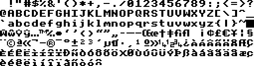  
  
LCD  
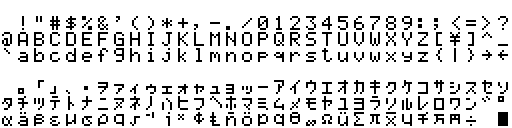  
  
Outline  
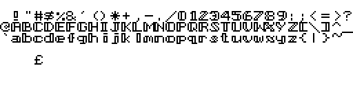  
  
PCchars  
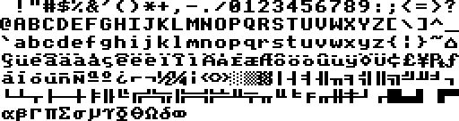  
  
README.md  
  
  
Serif  
  
  
Shadow  
  
  
Simple  
  
  
Theatrical  
  
  
Thin1  
  
  
Thin2  
  
  
Thin3  
  
  
TMSR  
  
  
TMSRItalic  
  
  
TMSRLight  
  
  
tools  
  
  
TrekFont  
  
  
TtxtJoin  
  
  
TtxtSepr  
  
  
Wimp0  
  
  
Wimp1  
  
  
Wimp2  
  
  
