Amstrad.bin  
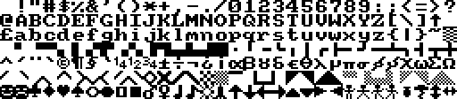  

Bubble.bin  
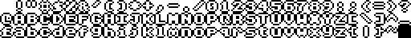  

Cursive.bin  
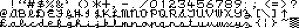  

CyrilThin.bin  
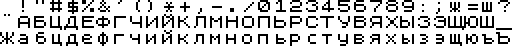  

Cyrillic.bin  
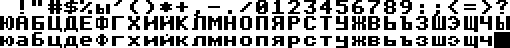  

DataRun.bin  
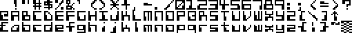  

Gothic.bin  
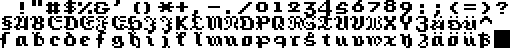  

Hiragana5.bin  
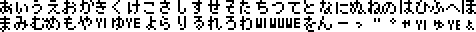  

IBM.bin  
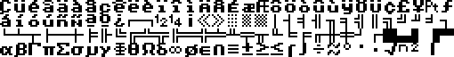  

MOS120.bin  
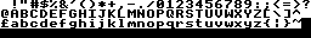  

Master.bin  
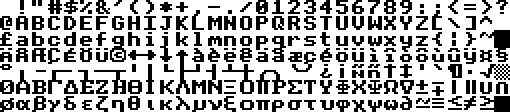  

RUNES.bin  
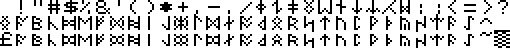  

Slant.bin  
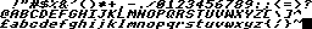  

SpecUDGs.bin  
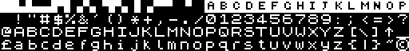  

Spectrum.bin  
  

Symbols.bin  
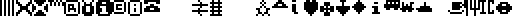  

Thick.bin  
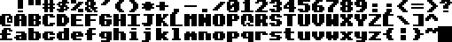  

Thin.bin  
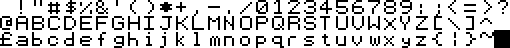  

TtxtFont.bin  
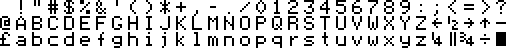  

Type.bin  
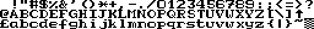  

merp.bin  
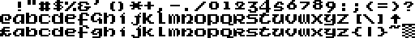  

