Amstrad
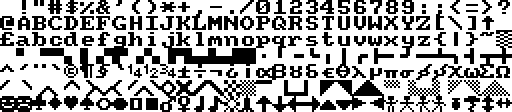

Bubble
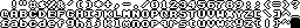

Cursive
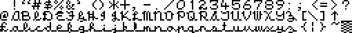

Cyrillic
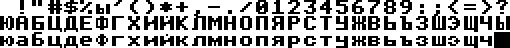

CyrilThin
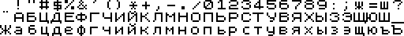

DataRun
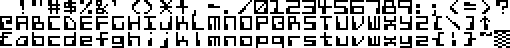

Gothic
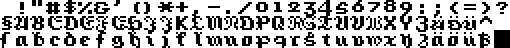

Hiragana5
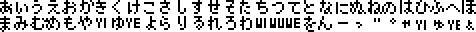

IBM
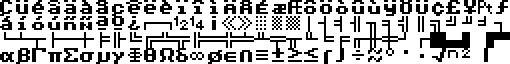

images

Master
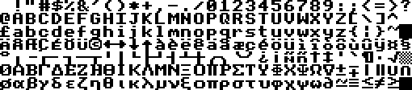

merp
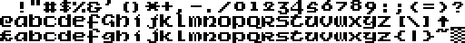

README.md

RUNES
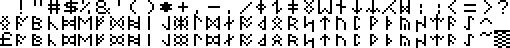

Slant
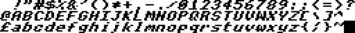

Spectrum
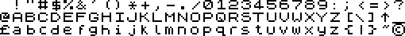

SpecUDGs
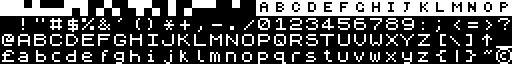

Symbols
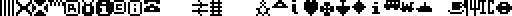

Thick
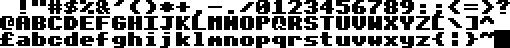

Thin
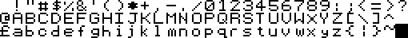

TtxtFont
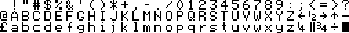

Type
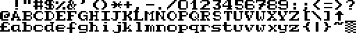

