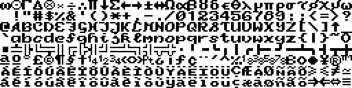
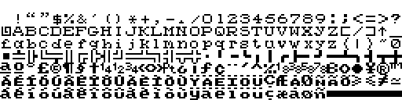

alarm8x5.raw  
  

alarm8x8.raw  
  

army.raw  
  

arty.raw  
  

bold.raw  
  

bold2.raw  
  

capitals.raw  
  

charset1.raw  
  

charset2.raw  
  

charset3.raw  
  

chunkee.raw  
  

chunkee2.raw  
  

data1.raw  
  

data2.raw  
  

fatty.raw  
  

feniceb.raw  
  

fin.raw  
  

fletcher.raw  
  

gothic.raw  
  

gras.raw  
  

gsanspcw.raw  
  

handy2.raw  
  

ibm.raw  
  

italic.raw  
  

joindup.raw  
  

lawson.raw  
  

lcd.raw  
  

neat1.raw  
  

neat2.raw  
  

newchars.raw  
  

pcw8x5.raw  
  

pcw8x8.raw  
  

rounded.raw  
  

sanserif.raw  
  

serif.raw  
  

small1.raw  
  

small2.raw  
  

square.raw  
  

square1.raw  
  

square2.raw  
  

tidymk2.raw  
  

tiny.raw  
  

tsanspcw.raw  
  

udgfin.raw  
  

