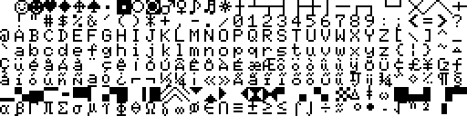

charset_arabian.raw  
  

charset_brazilian_g.raw  
  

charset_brazilian_g10.raw  
  

charset_brazilian_s.raw  
  

charset_brazilian_s11.raw  
  

charset_german.raw  
  

charset_international.raw  
  

charset_japanese.raw  
  

charset_korean.raw  
  

charset_russian.raw  
  

intvz.raw  
  

iso-lat1.raw  
  

msx-int.raw  
  

msx-int2.raw  
  

msx-jap.raw  
  

msx-jap2.raw  
  

msx-jap3.raw  
  

msx-kor.raw  
  

msx-rus.raw  
  

msx1_br.raw  
  

msx2_eur.raw  
  

msx2_jap.raw  
  

msx2_rus.raw  
  

win-1252.raw  
  

