Converted from https://int10h.org/oldschool-pc-fonts/ back to RAW. Two scripts for your convenience to rename them to 8.3 for oldschool systems.  

ACER71-1.RAW   
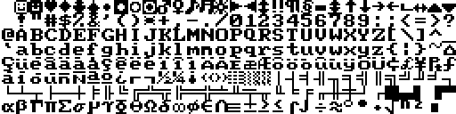  

ACER_V-1.RAW   
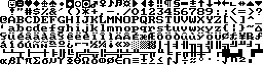  

ACM_VG-1.RAW   
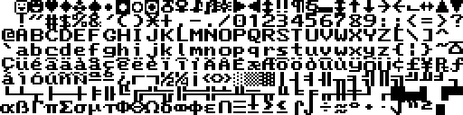  

AMI_EG-1.RAW   
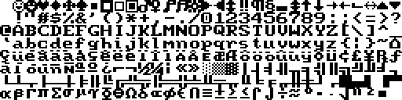  

AMSTRA-1.RAW   
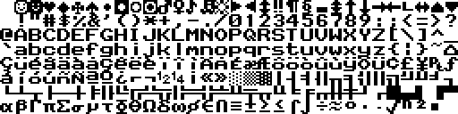  

APRICO-1.RAW   
  

APRICO-2.RAW   
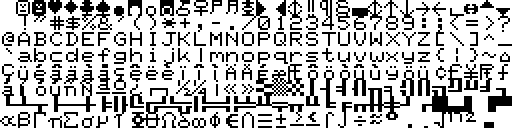  

ATI_8X-1.RAW   
  

ATI_SM-1.RAW   
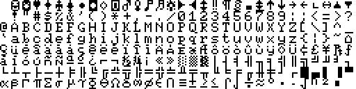  

COMPAQ-1.RAW   
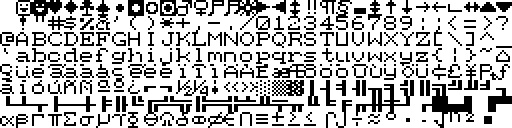  

COPAM_-1.RAW   
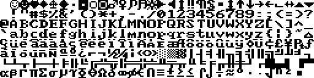  

DG_ONE-8.RAW   
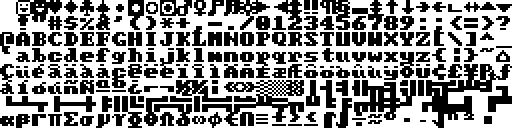  

DTK_BI-1.RAW   
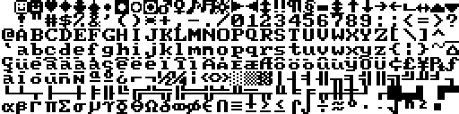  

EAGLES-1.RAW   
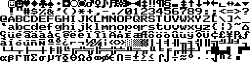  

EAGLES-2.RAW   
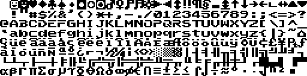  

EAGLES-3.RAW   
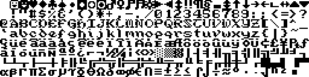  

EPSONM-1.RAW   
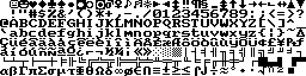  

EPSONM-2.RAW   
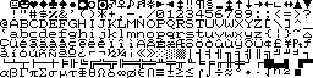  

EUROPC-1.RAW   
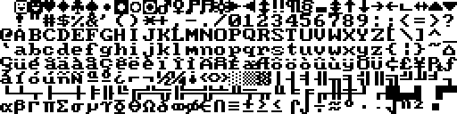  

EVEREX-1.RAW   
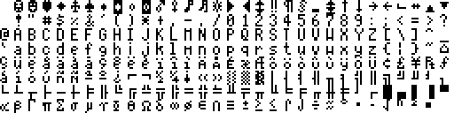  

EVEREX-2.RAW   
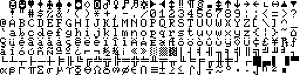  

FMTOWN-1.RAW   
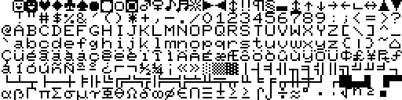  

HP_100-1.RAW   
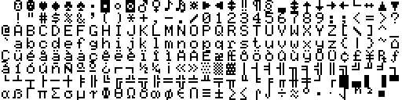  

HP_100-2.RAW   
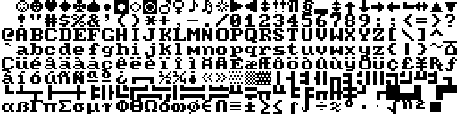  

IBM_BI-1.RAW   
  

IBM_CG-1.RAW   
  

IBM_CG-2.RAW   
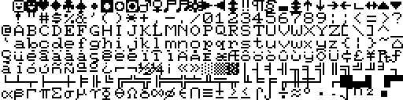  

IBM_CO-1.RAW   
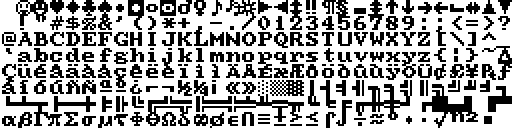  

IBM_EG-1.RAW   
  

ITT_XT-1.RAW   
  

KAYPRO-1.RAW   
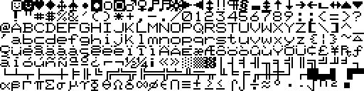  

LE_MOD-1.RAW   
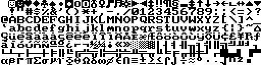  

MASTER-1.RAW   
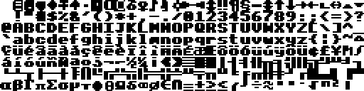  

MBYTEP-1.RAW   
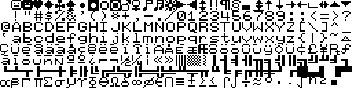  

MINDSE-1.RAW   
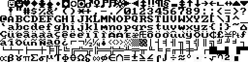  

NEC_AP-1.RAW   
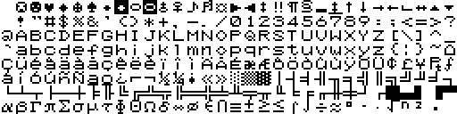  

NEC_MU-1.RAW   
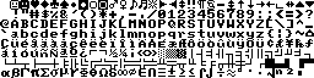  

NIX881-1.RAW   
  

OLIVET-1.RAW   
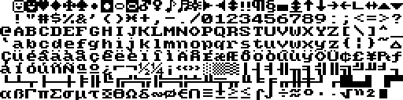  

PHOENI-1.RAW   
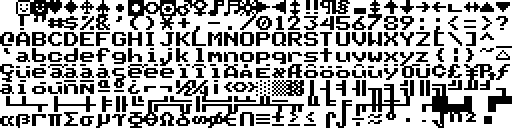  

PHOENI-2.RAW   
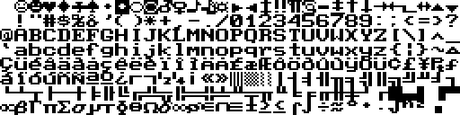  

PHOENI-3.RAW   
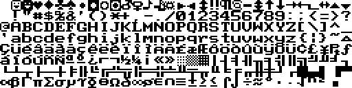  

PORTFO-1.RAW   
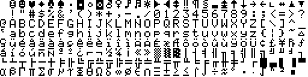  

SANYOM-1.RAW   
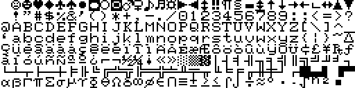  

SANYOM-2.RAW   
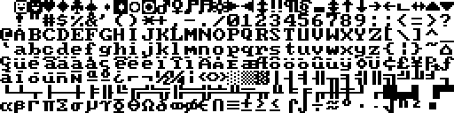  

SANYOM-3.RAW   
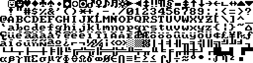  

SEEQUA-1.RAW   
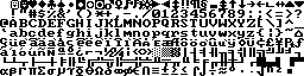  

SHARP_-1.RAW   
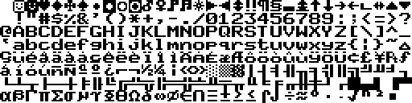  

SHARP_-2.RAW   
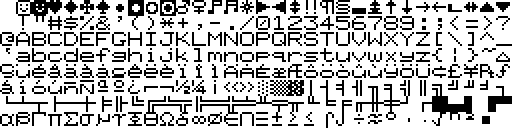  

SIGMA_-1.RAW   
  

SPERRY-1.RAW   
  

TANDY1-1.RAW   
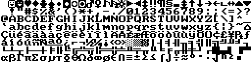  

TANDY1-2.RAW   
  

TANDY2-1.RAW   
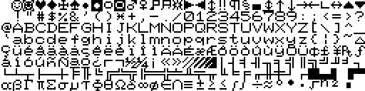  

TOSHIB-1.RAW   
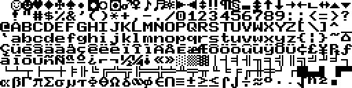  

TOSHIB-2.RAW   
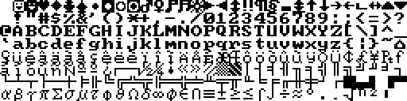  

TOSHIB-3.RAW   
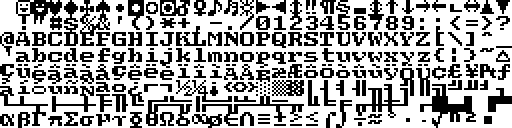  

TOSHIB-4.RAW   
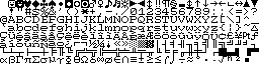  

TRIDEN-1.RAW   
  

TRIDEN-2.RAW   
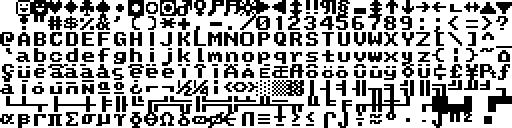  

TSENGE-1.RAW   
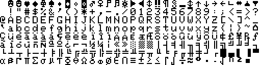  

VERITE-1.RAW   
  

VTECH_-1.RAW   
  

