Sources:  
.raw files converted from https://int10h.org/oldschool-pc-fonts/ back to RAW.  
.bin files from https://github.com/spacerace/romfont  

3dfx8x8.bin  
  

50146chareuro_8x8in8x16.bin  
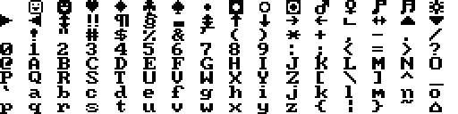  

acer500-II_cga_rom_01__8x8.bin  
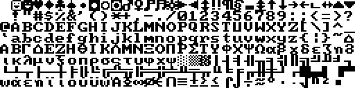  

acer500-II_cga_rom_02__8x8.bin  
  

acer500-II_cga_rom__8x8.bin  
  

Acer710_CGA-8.raw  
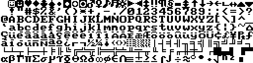  

Acer_VGA_8x8-8.raw  
  

ACM_VGA_8x8-8.raw  
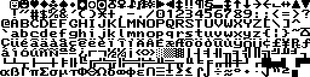  

ami386__8x8.bin  
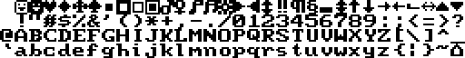  

AMI_EGA_8x8-8.raw  
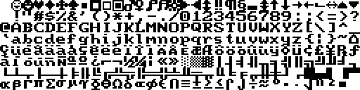  

ami-ega__8x8.bin  
  

ami_winbios8x8.bin  
  

Amstrad_PC-8.raw  
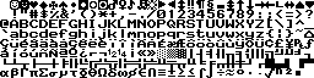  

amxtv132__8x8.bin  
  

Apricot_200L-8.raw  
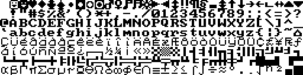  

ApricotPortable-8.raw  
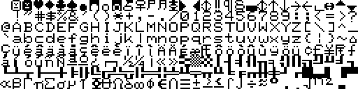  

ATI_8x8-8.raw  
  

ATIEgaWonder800p_8x8.bin  
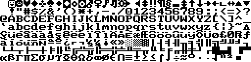  

ATI_SmallW_6x8-8.raw  
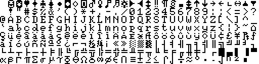  

ati_small_wonder_rev1_GR-ROM_01__8x8.bin  
  

ati_small_wonder_rev1_GR-ROM_02__8x8.bin  
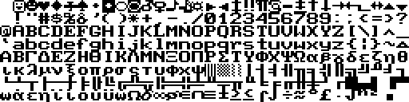  

ati_small_wonder_rev1_GR-ROM_03__8x8.bin  
  

ati_small_wonder_rev1_GR-ROM_04__8x8.bin  
  

ati_small_wonder_rev1_GR-ROM__8x8.bin  
  

ATIx550_8x8.bin  
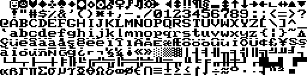  

AVGA2_8x8.bin  
  

award-2.05_8x8.bin  
  

BLADE3D_AGP__8x8.bin  
  

BLADE3D_AGP_HIS__8x8.bin  
  

BLADE3D_PCI__8x8.bin  
  

BLADEXP__8x8.bin  
  

bochslower127_8x8.bin  
  

CGA_PRAVETZ_01__8x8.bin  
  

CGA_PRAVETZ_02__8x8.bin  
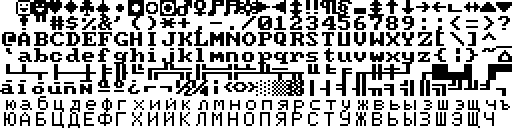  

CGA_PRAVETZ_03__8x8.bin  
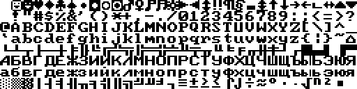  

CGA_PRAVETZ_04__8x8.bin  
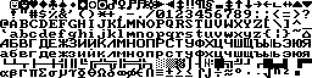  

CGA_PRAVETZ__8x8.bin  
  

CLGD5442_8x8.bin  
  

CompaqThin_8x8-8.raw  
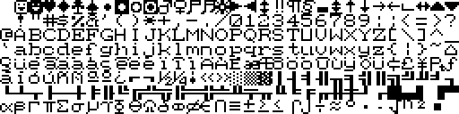  

Connect3d_Infineon_8x8.bin  
  

Copam_BIOS-8.raw  
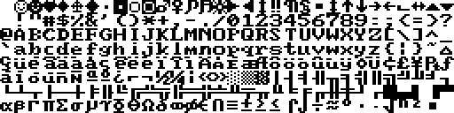  

DG_One-8.raw  
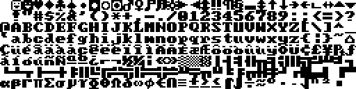  

DiamonStealth64_8x8.bin  
  

DTK_BIOS-8.raw  
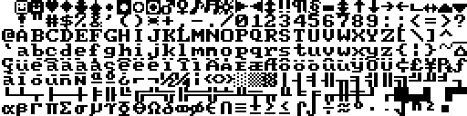  

dtk_erso_2__8x8.bin  
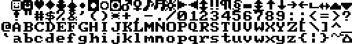  

EagleSpCGA_Alt1-8.raw  
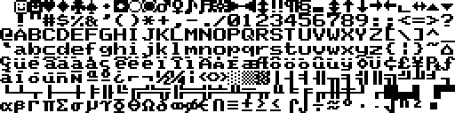  

EagleSpCGA_Alt2-8.raw  
  

EagleSpCGA_Alt3-8.raw  
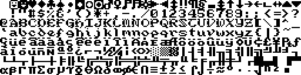  

ElsaVIC2_8x8.bin  
  

EpsonMGA-8.raw  
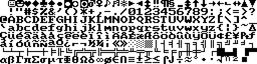  

EpsonMGA_Alt-8.raw  
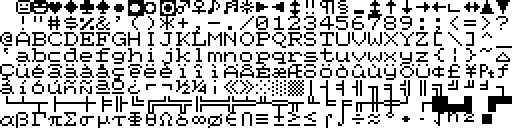  

et4000_stb__8x8.bin  
  

et4000w32isa_8x8.bin  
  

et4000_weirdlowerL_8x8.bin  
  

EuroPC_CGA-8.raw  
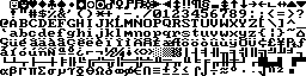  

EverexME_5x8-8.raw  
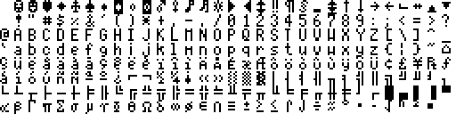  

EverexME_7x8-8.raw  
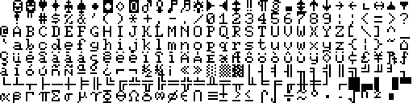  

FMTowns_re_8x8-8.raw  
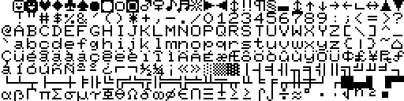  

FujitsuSiemensX300M_8x8.bin  
  

G400_8x8.bin  
  

GENOA_8x8.bin  
  

genoa-ega-2__8x8.bin  
  

genxt__8x8.bin  
  

HP_100LX_6x8-8.raw  
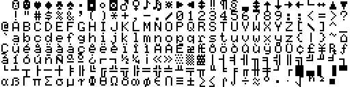  

HP_100LX_8x8-8.raw  
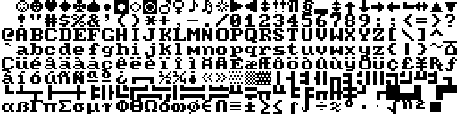  

ibm5155_cga_rom_memotek-gr_01__8x8.bin  
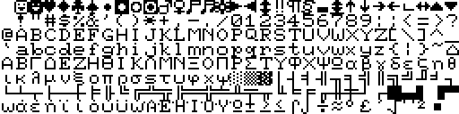  

ibm5155_cga_rom_memotek-gr_02__8x8.bin  
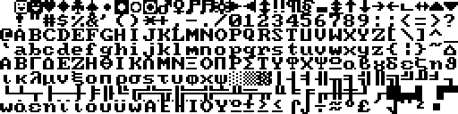  

ibm5155_cga_rom_memotek-gr_03__8x8.bin  
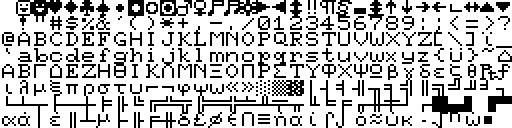  

ibm5155_cga_rom_memotek-gr_04__8x8.bin  
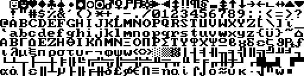  

ibm5155_cga_rom_memotek-gr_05__8x8.bin  
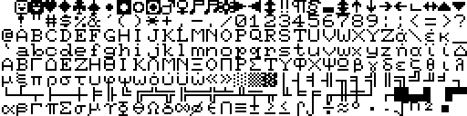  

ibm5155_cga_rom_memotek-gr_06__8x8.bin  
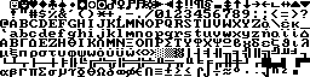  

ibm5155_cga_rom_memotek-gr_07__8x8.bin  
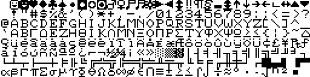  

ibm5155_cga_rom_memotek-gr_08__8x8.bin  
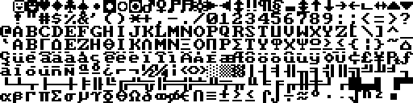  

ibm5155_cga_rom_memotek-gr_09__8x8.bin  
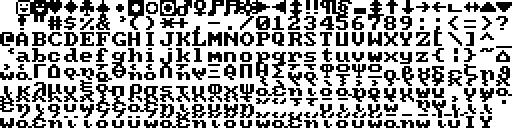  

ibm5155_cga_rom_memotek-gr_10__8x8.bin  
  

ibm5155_cga_rom_memotek-gr__8x8.bin  
  

IBM_BIOS-8.raw  
  

IBM_CGA-8.raw  
  

IBM_CGAthin-8.raw  
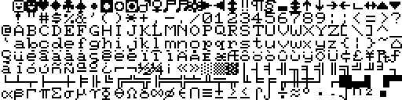  

IBM_Conv-8.raw  
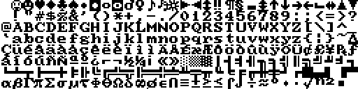  

IBM_EGA_8x8-8.raw  
  

ibm-ega__8x8.bin  
  

IBM_PC_BIOS_1981-04-24_HALF_8x8.bin  
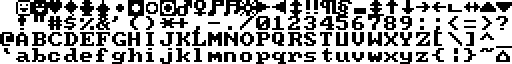  

IBM_PC_V1_8x8.bin  
  

IBM_PC_V2_8x8.bin  
  

IBM_PC_V3_8x8.bin  
  

IBM_VGA_8x8.bin  
  

IBM_XT286_V1_8x8.bin  
  

IBM_XT_V1-V3_8x8.bin  
  

ITT_Xtra-8.raw  
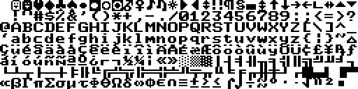  

Kaypro2K_G-8.raw  
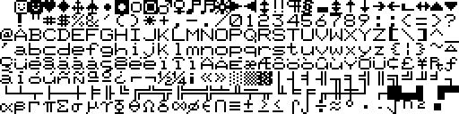  

LE_Model_D_CGA-8.raw  
  

M32_8x8.bin  
  

M64gx_8x8.bin  
  

Master_512-8.raw  
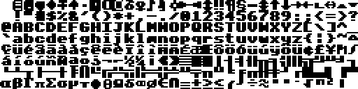  

MBytePC230_CGA-8.raw  
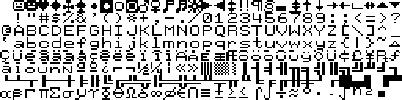  

MGAMIL2_8x8.bin  
  

Mindset-8.raw  
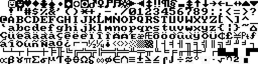  

MIROV968_8x8.bin  
  

MORSEKP800_8x8.bin  
  

NCR_GD5428_8x8.bin  
  

NEC_APC3_8x8-8.raw  
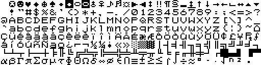  

NEC_MultiSpeed-8.raw  
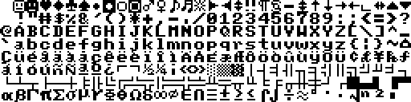  

Nix8810_M35-8.raw  
  

NSILogic-SmartEGAPlus-04-086-01Rev1__8x8.bin  
  

OakTechnolgy-unknown-1__8x8.bin  
  

OakTechnolgyVGA-KO77__8x8.bin  
  

Olivetti_M15-8.raw  
  

olivetti-m24_8x8.bin  
  

opt495sx__8x8.bin  
  

phoenix-2__8x8.bin  
  

Phoenix_BIOS-8.raw  
  

PhoenixEGA_8x8-8.raw  
  

PhoenixVGA_8x8-8.raw  
  

Portfolio_6x8-8.raw  
  

QuadtelS3_86C801_86C805EnhancedVGABIOS-Version2__8x8.bin  
  

QuadtelVGABIOSVersion1__8x8.bin  
  

R128GL_8x8.bin  
  

Riva128A_8x8.bin  
  

s3_764__8x8.bin  
  

S3Trio64V_8x8.bin  
  

S3VirgeGX_8x8.bin  
  

SanyoMBC16-8.raw  
  

SanyoMBC55x-8.raw  
  

SanyoMBC775-8.raw  
  

Sapphire9600NP256_8x8.bin  
  

Sapphire9600NPRO128_8x8.bin  
  

seabios8x8.bin  
  

SeequaCm-8.raw  
  

Sharp_PC3K-8.raw  
  

Sharp_PC3K_Alt-8.raw  
  

Sigma_RM_8x8-8.raw  
  

SperryPC_CGA-8.raw  
  

SVGA141__8x8.bin  
  

Tandy1K-I_200L-8.raw  
  

Tandy1K-II_200L-8.raw  
  

Tandy2K_G-TV-8.raw  
  

tgui9400cxi__8x8.bin  
  

TNT2M64_8x8.bin  
  

ToshibaSat_8x8-8.raw  
  

ToshibaT300_8x8-8.raw  
  

toshiba_t5200c_bios_vers_3__1__8x8.bin  
  

toshiba_t5200c_bios_vers_3__2__8x8.bin  
  

toshiba_t5200c_bios_vers_3__8x8.bin  
  

ToshibaTxL1_8x8-8.raw  
  

ToshibaTxL2_8x8-8.raw  
  

Trident_8x8-8.raw  
  

TridentEarly_8x8-8.raw  
  

TSENG_ET3000AX_ISAVGA_8x8.bin  
  

TsengEVA_132_6x8-8.raw  
  

TsengLabsVGA-4000BIOSV1__8x8.bin  
  

TSVGA_ET4000_8x8.bin  
  

tvga8800cs_2__8x8.bin  
  

tvga8800cs__8x8.bin  
  

tvga9000a_d211__8x8.bin  
  

tvga9000a_d301__8x8.bin  
  

tvga9000a_japan__8x8.bin  
  

tvga9000i-2__8x8.bin  
  

tvga-c4__8x8.bin  
  

tvga-d3__8x8.bin  
  

V7MERC_8x8.bin  
  

V7_Vega_8x8.bin  
  

VANTA__8x8.bin  
  

Verite_8x8-8.raw  
  

vgaedge16__8x8.bin  
  

video_seven_vega_vga_62L1989V5_435-0016-47__8x8.bin  
  

Voodoo3PCI_8x8.bin  
  

VTech_BIOS-8.raw  
  

VTech-LaserTurboXT-BIOS-V1__8x8.bin  
  

VTech-LaserXT3-BIOS-V1__8x8.bin  
  

wang_3050_BIOS_ROM__8x8.bin  
  

wd-pega__8x8.bin  
  

WIN1KXHR__8x8.bin  
  

WONDER16__8x8.bin  
  

XGA_8x8.bin  
  
