Adventura32.ch8
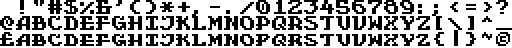

Alien32.ch8

Amstrad32.ch8

Arcade32.ch8

Arcadian32.ch8

Atari2-32.ch8

Atari32.ch8

Attica32.ch8

BBC1.ch8

BBC7.ch8
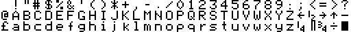

Braggadocio32.ch8

Brassy32.ch8

CBM32.ch8
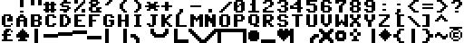

Chunky32.ch8
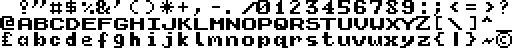

Crusoe32.ch8

Esmeralda32.ch8
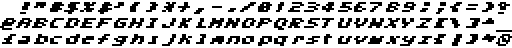

FatBoy.ch8
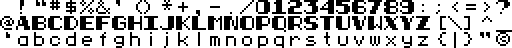

Future32.ch8
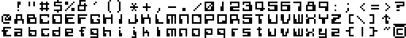

GameBoy32.ch8
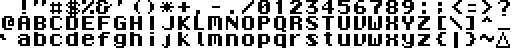

GothikA32.ch8

GothikB32.ch8
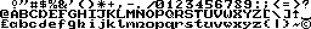

Greek32.ch8
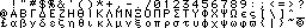

IBM32.ch8

Inferno32.ch8
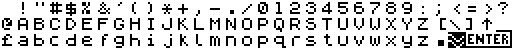

Kombat32.ch8

Miniset32.ch8
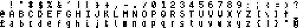

NES-Elite32.ch8

OldEnglish32.ch8
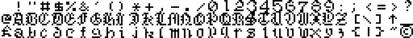

Oric32.ch8
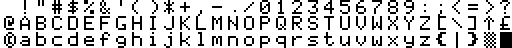

Perfect64-32.ch8
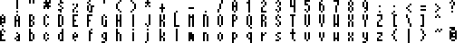

Russian32.ch8
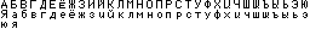

Sinclair32.ch8
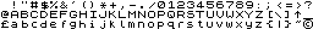

Sinclair40.ch8
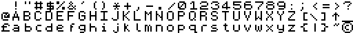

Skeleton32.ch8
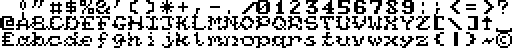

SmallCaps32.ch8

Trader32.ch8
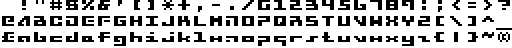

Trnang32.ch8

Zaibatsu32.ch8

