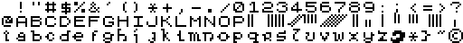

Adventura32.ch8

Alien32.ch8

Amstrad32.ch8

Arcade32.ch8

Arcadian32.ch8

Atari2-32.ch8

Atari32.ch8

Attica32.ch8

BBC1.ch8

BBC7.ch8

Braggadocio32.ch8

Brassy32.ch8

CBM32.ch8

Chunky32.ch8

Crusoe32.ch8

Esmeralda32.ch8

FatBoy.ch8

Future32.ch8

GameBoy32.ch8

GothikA32.ch8

GothikB32.ch8

Greek32.ch8

IBM32.ch8

Inferno32.ch8

Kombat32.ch8

Miniset32.ch8

NES-Elite32.ch8

OldEnglish32.ch8

Oric32.ch8

Perfect64-32.ch8

Russian32.ch8

Sinclair32.ch8

Sinclair40.ch8

Skeleton32.ch8

SmallCaps32.ch8

Trader32.ch8

Trnang32.ch8

Zaibatsu32.ch8

